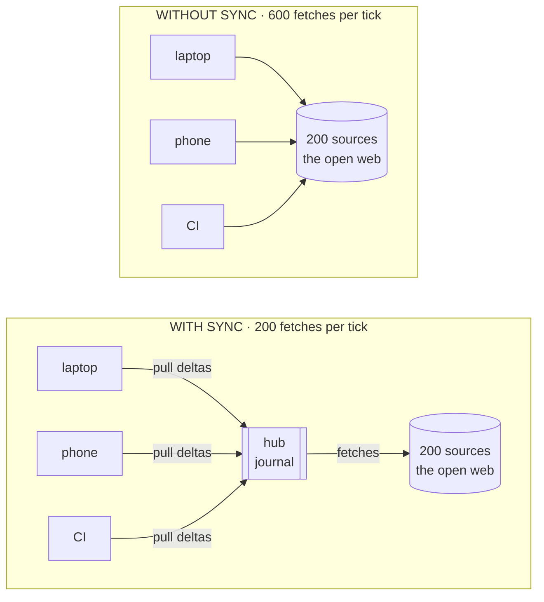
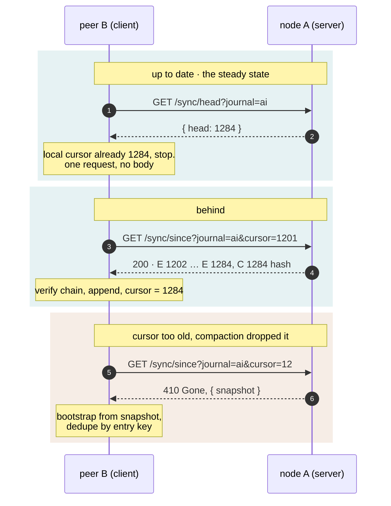
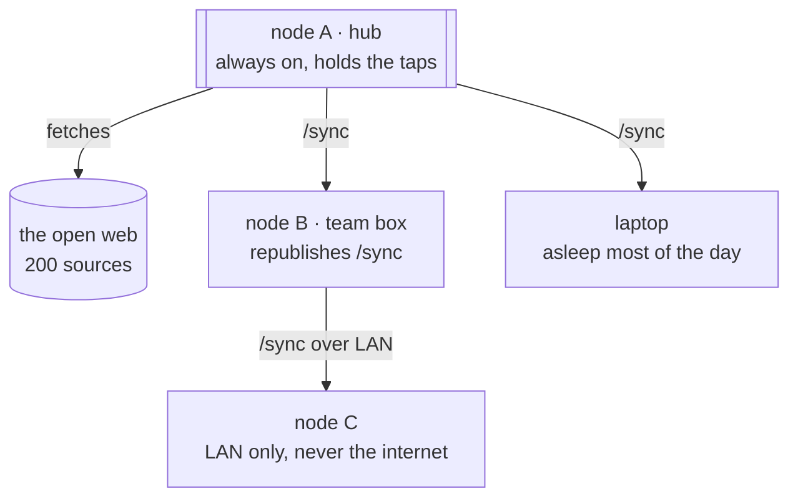

# Epic 12: NWF sync (delta exchange between peers)

## Goal

Promote NWF from a format to a **protocol**. Two Neurowire nodes exchange
journal deltas: "here is my head cursor" / "here is everything after it". A
node aggregates its own sources once, and downstream peers (a laptop, a second
server, a friend's node) pull compact deltas instead of re-fetching every
upstream site. Chains of nodes form a store-and-forward news mesh with no
central hub.

This is deliberately **pull-only HTTP** in v1: boring transport, novel payload.
The value is the protocol spec plus the journal semantics, not exotic
networking.

## Why not just fetch the sources directly?

The obvious objection: every node can already run `fetchMesh` itself, so why ask
a peer? Because direct fetching does not scale across machines, and it cannot
recover time you were not running.

### Diagram 1: what fan-out costs



Three devices following the same 200 sources make 600 requests a tick against
those publishers, from three IPs that together look like a small scraping
operation. Routing through one hub makes it 200, and the devices pull compact
deltas instead. Only the hub needs the taps, and every device sees the same
corpus rather than three different snapshots.

### Diagram 2: the pull handshake



The steady state is the first case: one request that returns a number. A device
on a train wakes up, asks a question worth about 40 bytes, and usually goes
straight back to sleep. Entries move only when the cursor is actually behind,
and a cursor older than retention fails loudly (`410`) instead of quietly
returning a partial answer.

### Diagram 3: store-and-forward, no central hub



Peers are configured, not discovered. `A -> B -> C` is fine: C gets what B
already pulled from A. Because merging is idempotent by entry key, a diamond (C
peering with both A and B) stores one copy and a cycle terminates. Provenance
survives every hop: `entry.source` still names the outlet that published the
story, not the peer it arrived through.

## Real-life scenarios

### 1. A team of eight following 200 sources

Eight developers each run the same `daily` construct. Direct fetching means
1,600 requests per tick against a couple hundred publishers, from eight IPs that
look like a small scraping operation. Several of those hosts rate-limit; a few
will eventually block. Each developer also has to keep taps current locally, and
when a site redesigns, it breaks eight times.

With sync: one VPS journals the construct every 30 minutes and publishes
`/sync`. Eight laptops pull deltas. The publishers see one polite poller, the
team sees one identical corpus, and a broken tap is fixed once on the hub.

### 2. The laptop that is closed most of the day

A feed is a snapshot of the front page. Open your laptop at 18:00 and
`fetchMesh` truthfully reports what those sites are showing *now*, which for a
busy outlet may be the last three hours. Everything published while the lid was
shut has already scrolled off. No amount of direct fetching recovers it, because
the data is simply not on the page any more.

This is the case direct pulling **cannot** solve, only a journal can. The hub was
awake and recorded every entry; the laptop pulls `?cursor=<where I left off>` and
gets exactly the missed window, in order, with nothing duplicated.

### 3. Research that has to be reproducible

Someone analyzing six months of AI coverage needs every machine and every rerun
to see the same corpus. Direct fetches give a different snapshot per machine and
per hour, so results are not reproducible and cannot be checked by a colleague.

A synced journal is content-addressed by sequence number and chain-verified: cite
"journal `ai`, seq 1..48210, chain `9f1c…`" and anyone who syncs that journal can
reproduce the analysis byte for byte, then keep pulling deltas as it grows. The
`410 Gone` path matters here too: it makes retention explicit rather than letting
an archive quietly develop holes.

### When sync is the wrong tool

One machine following twenty feeds should just fetch them. Sync earns its keep at
device count, at intermittent connectivity, or when history matters, and adds an
operational dependency (a node to run) otherwise.

## Protocol: `nwf-sync/1`

Spec lives in `docs/formats/nwf-sync.md`, written before the code (same rule as
Epic 9). All endpoints are served by the api package under `/sync/*` and are
versioned by an `NWF-Sync-Version: 1` response header.

| Endpoint | Returns |
|----------|---------|
| `GET /sync/journals` | JSON list: `{ id, title, head: cursor, updated, entries }` per published journal |
| `GET /sync/head?journal=<id>` | JSON `{ head: cursor }` (cheap poll target) |
| `GET /sync/since?journal=<id>&cursor=<c>` | NWFJ lines after `c` (media type `application/x-nwf-journal`); `204` when up to date |
| `GET /sync/snapshot?journal=<id>` | full journal from its oldest retained segment (bootstrap and too-old-cursor recovery) |

Semantics:

- **Cursor too old** (compaction dropped the segment): `410 Gone` with a JSON
  body pointing at `/sync/snapshot`. The client re-bootstraps and dedupes by
  entry key, so recovery is safe if inelegant.
- **Integrity**: responses include the journal's checkpoint hash chain (`C`
  lines, Epic 9). Clients verify the chain across pulls; a mismatch aborts the
  merge and reports tampering or corruption.
- **Auth**: optional static bearer token (`NEUROWIRE_SYNC_TOKEN` on the server,
  `token` per peer in client config). Self-host stance (Epic 4): the operator
  owns transport security; TLS via their proxy.
- **Loop and duplicate safety**: merging is idempotent by entry key. A node
  that syncs the same story from two peers, or through a cycle of peers, stores
  it once. Entry `source` attribution (already in the model) survives hops, so
  provenance is never lost even after multiple forwards.

## Client side (`ingest/src/sync.ts`)

```ts
interface Peer { url: string; token?: string; journals?: string[] }

pullJournal(peer, journalId, store): Promise<{ added: number; head: JournalCursor }>
syncPeers(peers, store): Promise<SyncReport>   // all peers, all selected journals
```

- Fetches `head`, short-circuits when the local cursor matches, otherwise pulls
  `since`, verifies the hash chain, appends to the local journal store
  (Epic 9), records the new cursor per `(peer, journal)` in
  `~/.config/neurowire/peers-state.json`.
- Handles `410` with the snapshot bootstrap path.
- Reuses ingest fetch hardening (timeouts, retries, backoff) wholesale.

## Server side (api)

- `packages/api/src/sync.ts`: the four routes over a journal store directory.
- Publishing is explicit: `NEUROWIRE_SYNC_PUBLISH` env or
  `~/.config/neurowire/sync.json` names which journal ids are exposed. Nothing
  is published by default.
- Range responses stream (journals can be large; the store's segment files make
  `since` a seek plus a stream, not a full read).

## CLI surface

```
neurowire sync <peer-url> [--journal id] [--token t]   # one-shot pull
neurowire sync --peers                                 # all configured peers
neurowire peers list|add <url>|remove <url>            # manage ~/.config/neurowire/peers.json
```

- Synced journals are ordinary journals: `neurowire journal cat`, `tail
  --since`, mesh rendering, and the web page generator all consume them with
  zero new code, which is the payoff of Epic 9 being the shared substrate.
- `neurowire tail --from-peer <url> --journal <id>`: composition with Epic 12,
  implemented as poll-the-head plus `since` pulls (no SSE requirement on
  peers; SSE `/tail` remains the low-latency option when the peer offers it).

## The story this unlocks (document it, do not overbuild it)

One server node runs `tail --journal` over a construct (Epic 12 keeps journals
fresh), publishes them via `/sync`. A laptop pulls deltas on wake. A third node
peers with the laptop's node. The docs get a "federated setup" guide showing
this three-node topology, because the topology is configuration, not code.

## Non-goals

- No push, no gossip, no peer discovery, no DHT. Peers are explicitly
  configured URLs.
- No signing or identity in v1 (hash chain is integrity, not authenticity;
  signed checkpoints are the designed-for v2 slot in the spec's version field).
- No conflict resolution beyond idempotent entry-key merge (journals are
  append-only facts, not mutable documents; there is nothing to conflict).
- No relay quotas or abuse controls beyond the bearer token (self-host stance).

## Dependencies

- **Hard on Epic 9** (journals are the payload; cursors, segments, hash chain).
- Composes with Epic 12 (`tail` keeps journals fresh; `--from-peer`), but does
  not require it: cron plus `--journal` fetches also feed a published node.

## Files touched

| File | Change |
|------|--------|
| `docs/formats/nwf-sync.md` | new: the protocol spec (written first) |
| `packages/ingest/src/sync.ts` + test | new: pull client, peer state, chain verify |
| `packages/ingest/src/index.ts` | exports |
| `packages/api/src/sync.ts` + test | new: the four routes, publish config |
| `packages/api/src/app.ts` | mount `/sync/*` |
| `packages/cli/src/index.ts` | `sync` and `peers` subcommands |
| `packages/cli/src/pipeline.ts` | pure helpers for peer config parsing |
| `docs/guide/federation.md` | new: three-node setup guide; nav entry |
| `docs/guide/cli.md`, `docs/reference/api.md` | new surface documented |
| `README.md` | federation in the pitch |

## Steps

1. Write `docs/formats/nwf-sync.md` in full: endpoints, cursor semantics, error
   codes, chain verification, version negotiation.
2. Server routes over a fixture journal store; Hono test-client coverage for
   every status path (200, 204, 400, 401, 410).
3. Client pull with chain verification against the same fixtures; peer state
   file round-trip.
4. End-to-end test: in-process api instance A with a journal, client pulls into
   store B, appends land, cursors advance, second pull is a 204; then compact
   A's old segment and assert the 410-snapshot recovery path.
5. CLI `sync` / `peers` subcommands.
6. Federation guide plus changelog; `pnpm docs:build`.

## Tests

- Spec conformance per endpoint (status codes, media types, version header).
- Chain verification: clean pull passes; a flipped byte in transit aborts with
  a named error and no partial append.
- Idempotence: pulling the same delta twice, or the same entries via two peers,
  yields one copy (entry-key dedupe at append).
- Too-old cursor: 410 then snapshot bootstrap converges to the same store state
  as an uninterrupted sync.
- Auth: token required when configured, 401 otherwise; no token config means
  open (documented self-host stance).
- Peer state: crash between pull and state write is safe (state written only
  after append succeeds; re-pull dedupes).

## Risks

- **Spec lock-in.** The version header and the spec-first rule are the
  mitigation; v1 stays minimal on purpose so v2 (signatures, push hints) has
  room.
- **Trust model misread as security.** Docs must say plainly: the hash chain
  detects corruption, the bearer token gates access, and nothing here
  authenticates *content origin*; you sync from peers you chose to trust.
- **Big snapshots.** Segment streaming plus retention config on the store;
  bootstrap cost is paid once per peer.
- **Scope gravity toward p2p.** Non-goals section is the fence; discovery and
  gossip are explicitly out until pull federation proves itself.

## Acceptance

- Two nodes on one machine: node A journals a live mesh, publishes it; node B
  `neurowire sync` pulls it, and `neurowire journal cat` on B equals A's
  content; a second sync transfers only the delta (verified by byte count).
- Killing the connection mid-pull and re-syncing converges with no duplicates.
- The federation guide reproduces the three-node topology from scratch using
  only documented commands.
- Coverage thresholds hold; docs build passes.
